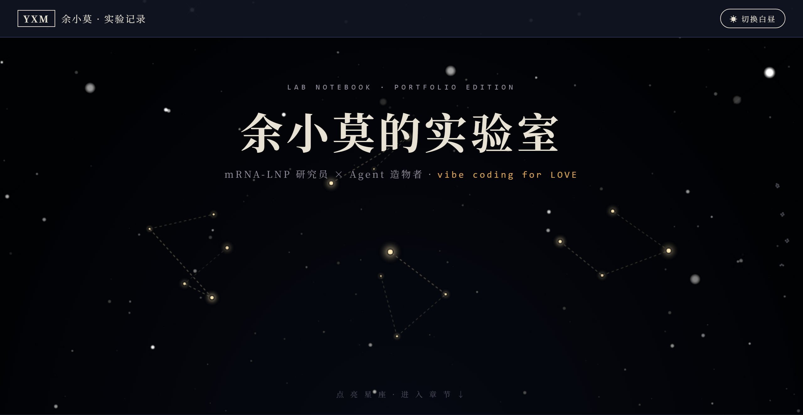

# 余小莫的星空观察台

> 一份把「开源 Skill · Agent 使用手记 · 自研 APP」装订成私人星表的个人作品集。
> 主站是一张深空星图，作品是星图上的星座——每个星座可点击、可导航。

[](https://rcrusoe88-bot.github.io/star-observatory/)

## 首页 · Hero



深空黑底上的原生 WebGL 星系（复刻 [reactbits.dev Galaxy](https://reactbits.dev/backgrounds/galaxy)），叠加四座缓慢自转的**三维星座导航**——图鉴座 / 进化座 / 手记座 / 装置座。鼠标划入星野会被「推开」，点击星座直接滑入对应章节。右上方可一键切换昼夜：入夜是纯白星点，白昼是暖琥珀墨星。

## 在线预览

🌐 **https://rcrusoe88-bot.github.io/star-observatory/**

> 由 GitHub Pages 自动部署，分支 `main` 根目录。每次 push 即重新发布。

## 视觉语言

整站只用一条隐喻线：**作品集 = 一份私人星表**。

| 设计因子 | 落点 |
|---|---|
| 专利插画风 | 章节以 `FIG. 1–4` 编号，线稿引线、斜体零件序号，Skill 图鉴配「装置剖视图」 |
| 星空星座导航 | Hero 四座可点击星座 + 右侧固定「星座罗盘」scroll-spy + 每章标题左侧 mini 星座 |
| 昼夜节律 | 19:00–06:00 自动入夜，右上角可手动切换 |
| Skill 图鉴 | 开源 skill 做成收藏卡（属性系别 / 稀有度 / 三个「技能」/ 捕获地） |
| 版本进化树 | 以 wechat-cover-design 为样本的主干 + 虚线分支谱系图 |
| Agent 使用手记 | 真实排障记录，每条以「观察结论 →」收尾；点卡直达 `notes.html` 文章页 |
| 星表落款 | 页脚三座小星座 + 观测者手写签名 + 星表编号 |

## 内容（已同步自 GitHub，剔除 fork）

**开源 Skill（6 件）** · 数据来自 `github.com/rcrusoe88-bot`：

- `wechat-title-summary` — 公众号标题/摘要生成（Shell）
- `wechat-article-html` — Word 转公众号 HTML（Python）
- `wechat-cover-design` — 手绘信息图风封面设计（Python）
- `mrna-cmc-web-search` — mRNA-LNP CMC 文献定向检索与核验
- `personal-resume` — 双视觉系个人简历生成器（HTML）
- `ppt-requirements-discovery` — PPT 需求多轮访谈发现（Codex）

**自研 APP**：`wsj-erp-system`（ERP 物料管理系统）、`yuxiaomo-ai-notes`（AI 笔记站）。

## 技术栈

- **零依赖单文件站**：纯 HTML/CSS/JS 内联，无构建步骤，可直接部署到 EdgeOne / GitHub Pages / 任意静态托管。
- **WebGL 星系**：完整移植 reactbits Galaxy 的 GLSL 着色器为原生 WebGL（约 150 行，移除 OGL/React 依赖）。
- **2D Canvas 三维星座**：每颗星带深度坐标，星群绕 Y 轴自转 + X 轴微倾，透视投影，画家算法深度排序消除连线交叉歧义。
- **性能**：Hero 离屏后通过 `IntersectionObserver` 暂停渲染循环，顶栏去 `backdrop-filter`，保证滚动顺滑。

## 本地运行

```bash
# 方式一：直接打开
open index.html        # macOS
# 或双击 index.html

# 方式二：本地静态服务器（推荐，避免 file:// 限制）
python3 -m http.server 8000
# 浏览器访问 http://localhost:8000
```

手记详情页：`notes.html#art-001`（点首页任意手记卡即跳转）。

## 文件结构

```
.
├── index.html        # 主站（星空观察台首页）
├── notes.html        # Agent 使用手记详情页（静态星座 + 单篇锁定）
├── hero.png          # README 首页预览图
└── README.md
```

---

*vibe coding for LOVE · 本星表持续生长*
